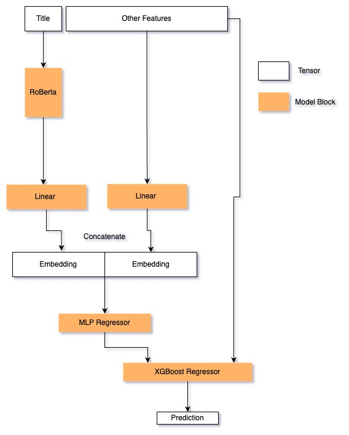

# Dcard HomeWork

## Model Architecture
The `Net` means RoBerta + Linears + Multi Layer Perceptron


## Training Step
1. set up environment (download python and pip package first)
```shell
pip install -r requirements.txt
```
2. start training
```shell
python train.py
    --lr_regressor [learning rate of Multi Layer Perceptron]
    --lr_bert [learning rate of Bert]
    --checkpoint_dir [directory to store model checkpoints]
    --batch_size [batch size to train the Net]
    --epochs [epochs to train to the Net]
    --save_every [save checkpoint of the Net every N epochs]
    --device [device to train on, ex. cuda]
    --nn_checkpoint [resume from checkpoint of the Net]
    --train_data [training data file route][required]
    --validation_data [validation data file route][required]
    --bert_type [bert name]
    --embed_dim [embed dimension]
    --xgb_estimators [n_estimators of XGBoost]
    --xgb_lr [learning rate of XGBoost]
    --xgb_colsample_bytree [colsample bytree of XGBoost]
    --xgb_max_depth [max depth of XGBoost]
    --plot_output_dir [the directory to store the loss graph]
```

## Testing Step
1. set up environment (download python and pip package first)
```shell
pip install -r requirements.txt
```
2. start training
```shell
python inference.py

    --device [device to train on, ex. cuda]
    --nn_checkpoint [resume from checkpoint of the Net][required]
    --xgb_checkpoint [resume from checkpoint of the XGBoost][required]
    --test_data [testing data file route][required]
    --bert_type [bert name]
    --embed_dim [embed dimension]
    --xgb_estimators [n_estimators of XGBoost]
    --xgb_lr [learning rate of XGBoost]
    --xgb_colsample_bytree [colsample bytree of XGBoost]
    --xgb_max_depth [max depth of XGBoost]
    --submit_example_file [example file to store result csv][required]
    --submit_file [result csv storing route]
```